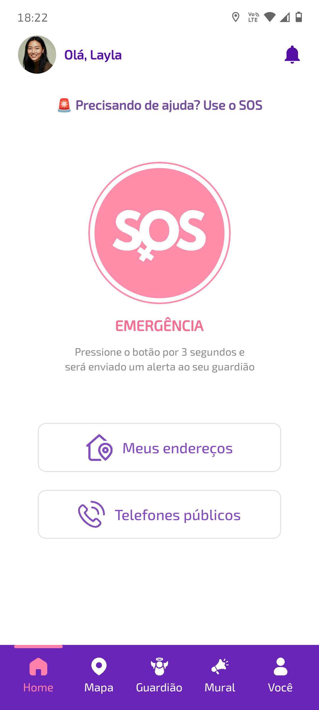
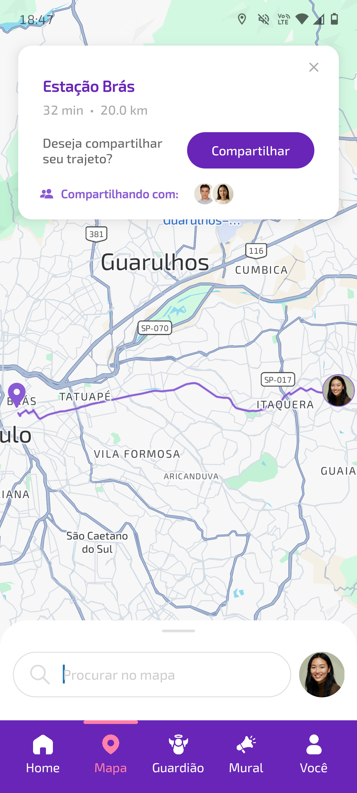
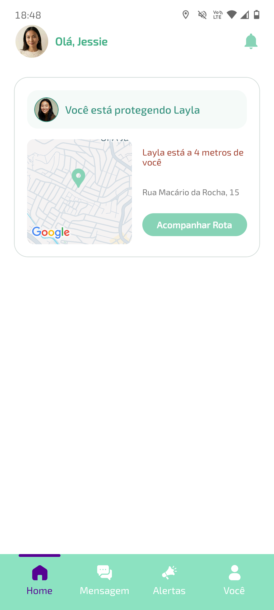
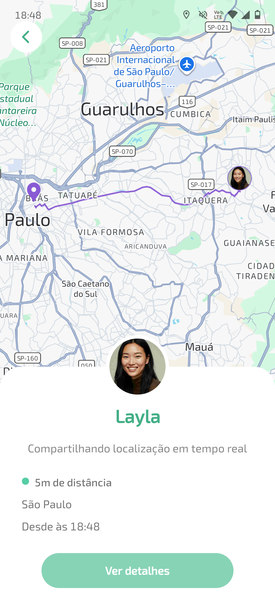
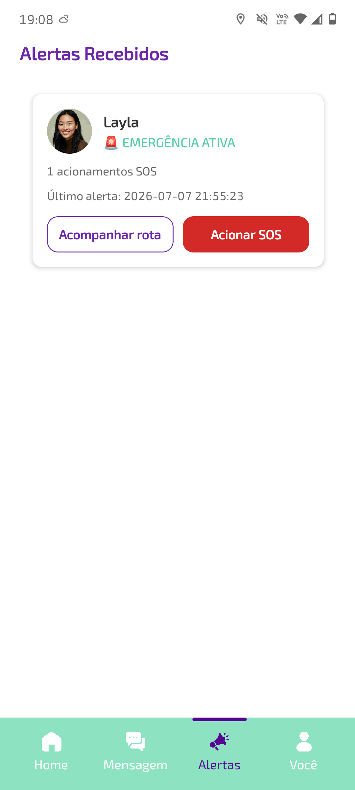
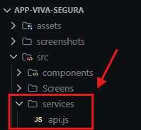
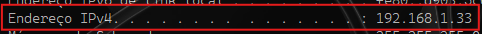
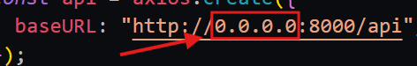

<div align="center">
  
</div>

<br>

**Viva Segura** é um aplicativo desenvolvido como Trabalho de Conclusão de Curso do curso Técnico de Desenvolvimento de Sistemas na **ETEC de Guaianazes**. O objetivo do app é oferecer segurança e proteção às mulheres durante seus deslocamentos diários.

## 💡 Sobre o projeto

Com o aumento de casos de feminicídio no Brasil, muitas mulheres se sentem **inseguras** ao se deslocarem desacompanhadas durante o cotidiano. 

O **Viva Segura** nasce para reduzir essa insegurança, permitindo que a usuária compartilhe sua localização, converse e acione ajuda de forma rápida.

O aplicativo conta com dois perfis de acesso:

- 👩 **Usuária** — perfil destinado ás mulheres, que utiliza os principais recursos do app.
- 😇 **Guardião** — contato de confiança escolhido pela usuária que acompanha seus deslocamentos e é acionado(a) em casos de emergência.

### Principais funcionalidades

- 🔐 **Autenticação e escolha de perfil** — ao entrar no app, o usuário define se é Usuária ou Guardião.
- 📍 **Compartilhamento de trajeto** — a Usuária compartilha seu trajeto em tempo real com o Guardião escolhido.
- 💬 **Chat** — comunicação direta entre Usuária e Guardião.
- 🚨 **Botão de SOS** — em situações de emergência, envia um alerta imediato ao Guardião.
- 📌 **Endereços de confiança** — a Usuária pode cadastrar endereços confiaveís (casa, trabalho, etc.).
- 📰 **Mural de notícias** — conteúdo informativo voltado ao público feminino.

<div align="center">

### 💻 Tecnologias utilizadas

&nbsp;
&nbsp;
&nbsp;
&nbsp;
&nbsp;
&nbsp;

<a href="https://project-osrm.org/">

  &nbsp;
  
</a>

</div>

## 📱 Prints do aplicativo

<h3 align="center">Usuária</h3>
<table align="center">
  <tr>
    <td align="center">Home</td>
    <td align="center">Mural de notícias</td>
    <td align="center">Mapa</td>
  </tr>
  <tr>
    <td></td>
    <td></td>
    <td></td>
  </tr>
</table>

<h3 align="center">Guardião</h3>
<table align="center">
  <tr>
    <td align="center">Home</td>
    <td align="center">Acompanhar rota</td>
    <td align="center">Central de Alertas (SOS)</td>
  </tr>
  <tr>
    <td></td>
    <td></td>
    <td></td>
  </tr>
</table>


## 📂 Estrutura do projeto

```
app-viva-segura/
├── assets/          # Imagens e ícones
├── screenshots/     # Prints
├── src/
│   ├── components/  # Componentes reutilizáveis da interface
│   ├── Screens/     # Telas do aplicativo
│   └── services/
│       └── api.js   # Configuração do IP e conexão com o banco
└── App.js           # Ponto de entrada da aplicação
```

## Como executar o projeto?

Como o aplicativo depende da API para realizar autenticação e armazenar os dados, o back-end deve estar funcionando **ANTES** de iniciar o app.

> ⚠️ **Importante:** durante a execução local, o celular e o computador precisam estar conectados à **mesma rede Wi-Fi**.

### 1. Rodando o back-end

O back-end está em um repositório separado, que utiliza o **XAMPP** para o banco de dados **MySQL** - 🔗 **[app-viva-segura-backend](https://github.com/Kaawanny/app-viva-segura-backend)**

**Pré-requisitos:**

Antes de iniciar, certifique-se de que os seguintes programas estão instalados:

- [PHP](https://www.php.net/)
- [Composer](https://getcomposer.org/) 
- [XAMPP](https://www.apachefriends.org/)

**Passo a passo:**

```bash
# Clone o repositório

git clone https://github.com/Kaawanny/app-viva-segura-backend.git
cd app-viva-segura-backend

# Instale as dependências
composer install

# Rode o XAMPP (inicie o módulo MySQL pelo painel do XAMPP)

# Rode as migrations
php artisan migrate

# Popule o banco com as Seeders
php artisan db:seed --class=RoleSeeder
php artisan db:seed --class=LocalSeguroSeeder

# Suba o servidor expondo na rede local
php artisan serve --host=0.0.0.0 --port=8000
```

> O `--host=0.0.0.0` permite que o servidor seja acessado pelo celular através da rede local. Sem essa configuração, a API ficará disponível apenas no computador por meio do `localhost`.

### 2. Rodando o aplicativo

Com o back-end em execução, agora é necessário configurar e iniciar o aplicativo.

**Pré-requisitos:**

Certifique-se de que os seguintes recursos estão instalados:

- [Node.js](https://nodejs.org/)
- [Expo CLI](https://docs.expo.dev/get-started/installation/) instalado globalmente
- [Expo Go](https://expo.dev/go) instalado no celular (Android/iOS) ou um emulador configurado

**Passo a passo:**

```bash
# Clone o repositório
git clone https://github.com/agthvie/app-viva-segura.git

# Acesse a pasta do projeto
cd app-viva-segura

# Instale as dependências
npm install
```
 
### 3. Configurando o endereço da API

Antes de iniciar o aplicativo, é necessário informar onde o back-end está sendo executado.

Para isso, abra o arquivo `api.js`, localizado na pasta `services`, e altere o endereço da API para utilizar o **IP local do computador**.



Como o aplicativo será executado no celular, não é possível utilizar simplesmente `localhost`. Nesse caso, o celular precisa acessar o computador pela **rede Wi-Fi** utilizando o endereço **IP local** da máquina.

**🛜 Como descobrir o IP local?**

Abra um novo terminal no computador e execute:

```bash
# Eexecute o comando
ipconfig
```

Procure por **"Endereço IPv4"** e copie o endereço apresentado.



> ❗ **Importante:** o celular e o computador precisam estar conectados à **mesma rede Wi-Fi** para que o aplicativo consiga acessar a API.

Depois de copiar o endereço IPv4, substitua o IP configurado na *url* do arquivo `api.js`.



### 4. Iniciando o aplicativo

Com o back-end funcionando e o IP configurado, o aplicativo já pode ser iniciado.

No terminal, dentro da pasta do projeto, execute:

```bash
# inicie o aplicativo
npx expo start
```

Após executar o comando, o *Expo* exibirá um **QR Code** no terminal.

Abra o aplicativo *Expo Go* no celular e escaneie o QR Code exibido.

Se todas as configurações estiverem corretas, o **Viva Segura** será carregado no dispositivo.

### ✨ Tudo pronto!

Agora você pode acessar o **Viva Segura** pelo Expo Go e explorar suas funcionalidades na prática.

#
<br>
<div align="center">

**Projeto dedicado a todas as mulheres que lutam por uma vida mais segura e livre da violência.**

</div>
